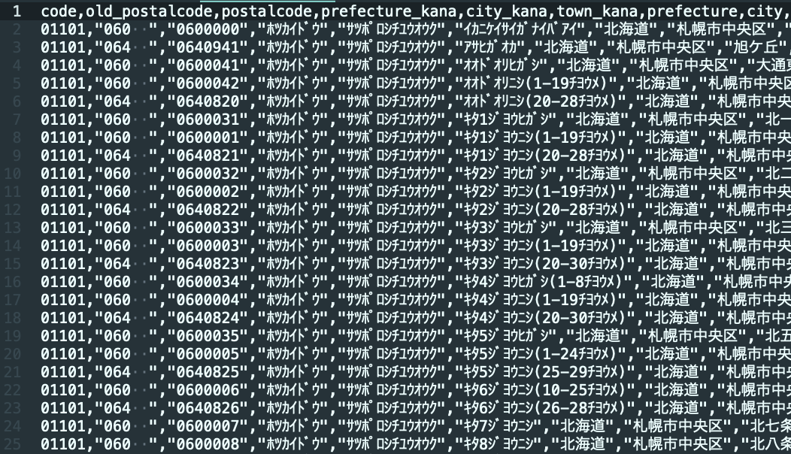
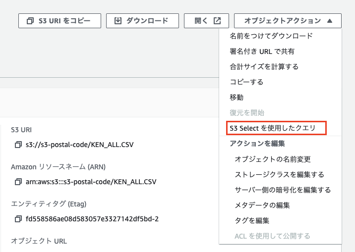
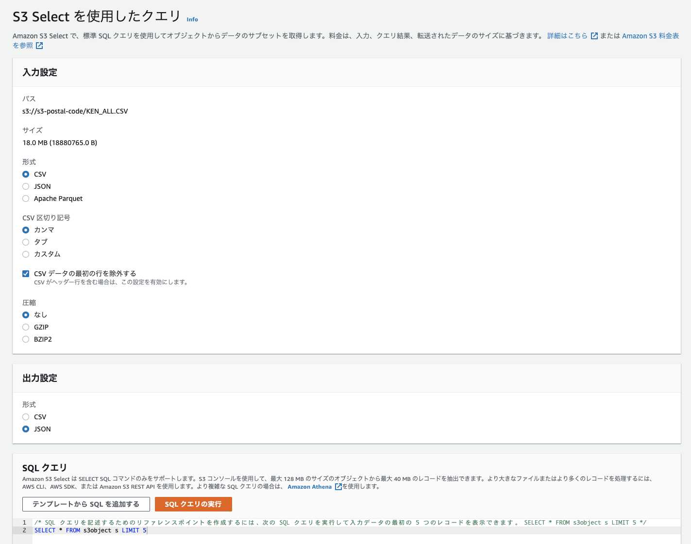

<!--
title:   S3にCSVをアップロードするだけで辞書型参照のAPIが作れる
tags:    aws,s3
id:      289970d48d432b106f1b
private: true
-->


AWS S3の機能に [S3 Select](https://aws.amazon.com/jp/blogs/news/querying-data-without-servers-or-databases-using-amazon-s3-select/) というものがあるのがあるのをご存知だろうか？  
S3 Select はS3に保存したCSVやJSONデータに対してSQLライクなクエリを発行することで、条件にマッチしたデータを検索し返すことができる機能である。  
Athena と比較すると、
- 取り扱えるデータ量に制限がある(MAX 256M)
- GROUP BY/ORDER BY などの集計系のクエリには対応していない

といったビハインドがあるものの、データカタログを事前に準備する必要がなく、S3にファイルをアップロードするだけで準備が整うので、とりあえず試してみるみたいなケースでは非常に使いやすい。  
クエリの発行は、Webコンソールか、もしくはSDKからの発行が可能。

ここまでの仕様から、辞書型のAPIであればコンピューティングリソース(serverlessを含む)を一切用意することなく、APIが構築可能ではないか？と思い実験してみた。

## 準備

今回は郵便番号から住所を検索するAPIを作る。住所フォームで郵便番号を入力したら住所が自動入力される、よく見かけるあれ。  
使用するのは、[日本郵政が公開しているCSVデータ](https://www.post.japanpost.jp/zipcode/dl/oogaki-zip.html)  
全国版だと、非圧縮で12.3M、124,528行(2022/02/15現在)。

そのままだと少し使用しづらいので、UTF8に変換し、1行目にヘッダ行を追加する。なお、ヘッダに日本語は使用できない。



このデータを適当に作成したS3バケットにアップロードし、後ほどブラウザの適当なページからアクセスするためCORSポリシーをよしなに変更して準備完了。

## webコンソールからクエリを発行してみる

オブジェクトアクションのプルダウンの中に S3 select 用のコンソールのリンクがある。



このように入力形式と出力形式を選択してクエリを発行する。



するとこんな感じのデータが得られる。
```json
{
  "code": "01101",
  "old_postalcode": "060  ",
  "postalcode": "0600000",
  "prefecture_kana": "ﾎﾂｶｲﾄﾞｳ",
  "city_kana": "ｻﾂﾎﾟﾛｼﾁﾕｳｵｳｸ",
  "town_kana": "ｲｶﾆｹｲｻｲｶﾞﾅｲﾊﾞｱｲ",
  "prefecture": "北海道",
  "city": "札幌市中央区",
  "town": "以下に掲載がない場合"
}
{
  "code": "01101",
  "old_postalcode": "064  ",
  "postalcode": "0640941",
  "prefecture_kana": "ﾎﾂｶｲﾄﾞｳ",
  "city_kana": "ｻﾂﾎﾟﾛｼﾁﾕｳｵｳｸ",
  "town_kana": "ｱｻﾋｶﾞｵｶ",
  "prefecture": "北海道",
  "city": "札幌市中央区",
  "town": "旭ケ丘"
}
...
```

集計はできないが、LIKE等のWHERE文は一通り書ける。
```sql
SELECT * FROM s3object s WHERE postalcode LIKE '10000%'
```

```json
{
  "code": "13101",
  "old_postalcode": "100  ",
  "postalcode": "1000000",
  "prefecture_kana": "ﾄｳｷﾖｳﾄ",
  "city_kana": "ﾁﾖﾀﾞｸ",
  "town_kana": "ｲｶﾆｹｲｻｲｶﾞﾅｲﾊﾞｱｲ",
  "prefecture": "東京都",
  "city": "千代田区",
  "town": "以下に掲載がない場合"
}
{
  "code": "13101",
  "old_postalcode": "100  ",
  "postalcode": "1000011",
  "prefecture_kana": "ﾄｳｷﾖｳﾄ",
  "city_kana": "ﾁﾖﾀﾞｸ",
  "town_kana": "ｳﾁｻｲﾜｲﾁﾖｳ",
  "prefecture": "東京都",
  "city": "千代田区",
  "town": "内幸町"
}
...
```

使用できる命令文の詳細はこちら。

https://docs.aws.amazon.com/ja_jp/AmazonS3/latest/userguide/s3-glacier-select-sql-reference.html

応答速度は、非圧縮12.3M、124,528行データで、150ms-250ms程度。  
データ量に応じて変動すると思われるが実験していない。

## ブラウザからJSで直接リクエストする

ここで API Gateway + Lambda を使ってREST APIを作ってもいいが、それだと芸がないので、ブラウザからJS(SDK)でコンピューティングリソースを経由せずに直接リクエストできるようにする。  
ちなみに、Lambdaを使用する場合でも、一見 S3 selectを使用するメリットがないように思えるが、CSVのパーサや検索ロジックを準備する必要がなく、またトークンやリソースのエンドポイントが露出しないので、そういった点ではメリットがある。  

まず、ブラウザ用のSDKを用意する。  

https://github.com/aws/aws-sdk-js#aws-sdk-for-javascript

S3に限らないオールインワンのCDN配信のスクリプトか、githubからクローンしてきて自身でS3用のモジュールだけをビルドする方法の2種類ある。  
好きな方を選べばよいが、サイズを考慮するのであれば、間違いなく後者を選択すべき。

